# ImpactCocoa Database Design

## 1. Mục đích

Tài liệu này gom toàn bộ thiết kế database của ImpactCocoa vào một file duy nhất để dễ đọc, dễ import vào NotebookLM và dễ visualize.

Phạm vi tài liệu:

- mô hình database tổng thể
- schema ownership theo service
- các bảng cốt lõi và quan hệ chính
- nguyên tắc khóa, index, scope, audit
- định hướng mở rộng cho production

## 2. Quyết định thiết kế

- dùng chung **1 PostgreSQL cluster**
- bật **PostGIS** cho dữ liệu geospatial
- tách ownership theo **schema-per-service**
- service chỉ được ghi vào bảng của chính nó
- foreign key xuyên schema chỉ dùng hạn chế cho identity ổn định
- reporting dùng bảng/read model riêng để tối ưu truy vấn

## 3. Các schema chính

| Schema | Vai trò | Bảng chính |
|---|---|---|
| `iam` | identity, RBAC, cooperative scope | `cooperatives`, `users`, `roles`, `permissions`, `user_cooperative_assignments` |
| `farmer` | hồ sơ farmer | `farmers`, `household_members`, `farmer_photos`, `profile_change_history` |
| `field_ops` | inspections, follow-up, training, coaching | `inspections`, `inspection_findings`, `follow_up_actions`, `training_sessions`, `coaching_visits` |
| `gis` | parcel, geometry, EUDR status | `parcels`, `parcel_geometries`, `parcel_characteristics`, `eudr_status` |
| `traceability` | purchase, batch, trace chain | `purchases`, `batches`, `batch_items`, `trace_links` |
| `reporting` | report runs, files, snapshots, caches | `report_runs`, `report_files`, `dashboard_snapshots` |
| `integration` | Kobo sync, migration, reconciliation | `kobo_submissions_raw`, `sync_jobs`, `migration_jobs`, `reconciliation_results` |
| `audit` | audit trail tập trung | `audit_logs`, `entity_changes`, `report_audit_logs` |

## 4. Sơ đồ tổng thể mức cao

```mermaid
flowchart TD
  IAM[iam]\nIdentity + RBAC
  FARMER[farmer]\nFarmer Master Data
  FIELDOPS[field_ops]\nInspection + Training + Coaching
  GIS[gis]\nParcels + PostGIS + EUDR
  TRACE[traceability]\nPurchases + Batches + Chain
  REPORT[reporting]\nReports + Dashboard Read Models
  INTEGRATION[integration]\nKobo Sync + Migration
  AUDIT[audit]\nCompliance Trail

  IAM --> FARMER
  IAM --> FIELDOPS
  IAM --> GIS
  IAM --> TRACE
  IAM --> REPORT
  IAM --> AUDIT

  FARMER --> FIELDOPS
  FARMER --> GIS
  FARMER --> TRACE

  GIS --> TRACE
  FIELDOPS --> REPORT
  TRACE --> REPORT
  GIS --> REPORT
  INTEGRATION --> FARMER
  INTEGRATION --> FIELDOPS
  INTEGRATION --> GIS
  INTEGRATION --> TRACE
  REPORT --> AUDIT
```

## 5. ERD cốt lõi

```mermaid
erDiagram
  IAM_COOPERATIVES ||--o{ IAM_USERS : default_scope
  IAM_USERS ||--o{ IAM_USER_ROLES : has
  IAM_ROLES ||--o{ IAM_USER_ROLES : assigned
  IAM_ROLES ||--o{ IAM_ROLE_PERMISSIONS : grants
  IAM_PERMISSIONS ||--o{ IAM_ROLE_PERMISSIONS : mapped
  IAM_USERS ||--o{ IAM_USER_COOPERATIVE_ASSIGNMENTS : scoped_to
  IAM_COOPERATIVES ||--o{ IAM_USER_COOPERATIVE_ASSIGNMENTS : includes

  IAM_COOPERATIVES ||--o{ FARMER_FARMERS : owns
  FARMER_FARMERS ||--o{ FARMER_HOUSEHOLD_MEMBERS : has
  FARMER_FARMERS ||--o{ FARMER_FARMER_PHOTOS : has
  FARMER_FARMERS ||--o{ FARMER_PROFILE_CHANGE_HISTORY : changes

  FARMER_FARMERS ||--o{ FIELD_OPS_INSPECTIONS : inspected
  FIELD_OPS_INSPECTIONS ||--o{ FIELD_OPS_INSPECTION_FINDINGS : contains
  FIELD_OPS_INSPECTIONS ||--o{ FIELD_OPS_FOLLOW_UP_ACTIONS : creates
  FARMER_FARMERS ||--o{ FIELD_OPS_TRAINING_ATTENDANCE : attends
  FIELD_OPS_TRAINING_MODULES ||--o{ FIELD_OPS_TRAINING_SESSIONS : scheduled
  FIELD_OPS_TRAINING_SESSIONS ||--o{ FIELD_OPS_TRAINING_ATTENDANCE : records
  FARMER_FARMERS ||--o{ FIELD_OPS_COACHING_VISITS : receives
  FIELD_OPS_COACHING_VISITS ||--o{ FIELD_OPS_COACHING_REPORTS : summarized_by
  FARMER_FARMERS ||--o{ FIELD_OPS_FARM_DEVELOPMENT_PLANS : planned_for

  FARMER_FARMERS ||--o{ GIS_PARCELS : owns
  GIS_PARCELS ||--|| GIS_PARCEL_GEOMETRIES : geometry
  GIS_PARCELS ||--|| GIS_PARCEL_CHARACTERISTICS : characteristics
  GIS_PARCELS ||--o| GIS_EUDR_STATUS : assessed
  GIS_PARCELS ||--o{ GIS_PARCEL_OVERLAP_FLAGS : flagged

  FARMER_FARMERS ||--o{ TRACEABILITY_PURCHASES : sells
  GIS_PARCELS ||--o{ TRACEABILITY_PURCHASES : sourced_from
  TRACEABILITY_BATCHES ||--o{ TRACEABILITY_BATCH_ITEMS : contains
  TRACEABILITY_PURCHASES ||--o{ TRACEABILITY_BATCH_ITEMS : assigned_to
  TRACEABILITY_BATCHES ||--o{ TRACEABILITY_TRACE_LINKS : traces
  TRACEABILITY_PURCHASES ||--o{ TRACEABILITY_TRACE_LINKS : traces
  FARMER_FARMERS ||--o{ TRACEABILITY_TRACE_LINKS : traces
  GIS_PARCELS ||--o{ TRACEABILITY_TRACE_LINKS : traces

  IAM_USERS ||--o{ REPORTING_REPORT_RUNS : requests
  REPORTING_REPORT_RUNS ||--o{ REPORTING_REPORT_FILES : outputs

  INTEGRATION_SYNC_JOBS ||--o{ INTEGRATION_SYNC_ERRORS : produces
  INTEGRATION_MIGRATION_JOBS ||--o{ INTEGRATION_RECONCILIATION_RESULTS : compares

  IAM_USERS ||--o{ AUDIT_AUDIT_LOGS : acts
  AUDIT_AUDIT_LOGS ||--o{ AUDIT_ENTITY_CHANGES : details
```



## 6. Chiến lược khóa chính

- gần như toàn bộ bảng dùng `UUID` làm primary key
- `audit.audit_logs` dùng `BIGSERIAL` vì đây là bảng ghi nhiều và cần thứ tự tăng dần
- một số business key giữ dạng natural key:
  - `iam.cooperatives.code`
  - `farmer.farmers.farmer_code`
  - `gis.parcels.field_id`
  - `traceability.batches.batch_number`

## 7. Quy tắc scope và phân quyền dữ liệu

Do SRS yêu cầu segregation theo district/cooperative ở API layer, database cần hỗ trợ rõ scope.

Các bảng trọng yếu có `cooperative_id` trực tiếp:

- `farmer.farmers`
- `field_ops.inspections`
- `field_ops.follow_up_actions`
- `field_ops.training_sessions`
- `field_ops.coaching_visits`
- `field_ops.farm_development_plans`
- `gis.parcels`
- `traceability.batches`
- `traceability.purchases`
- `reporting.report_runs`
- `audit.audit_logs`

Nguyên tắc:

- mọi query nghiệp vụ phải filter theo scope user
- frontend chỉ hỗ trợ UX, không quyết định security
- `Project Leader`, `System Administrator`, `Whittakers` có thể có all-district scope

## 8. Mô tả bảng cốt lõi theo domain

### 8.1 `iam`

#### `iam.cooperatives`
- master data cho cooperative và district
- key fields: `code`, `name`, `district_code`, `district_name`

#### `iam.users`
- user đăng nhập hệ thống
- key fields: `email`, `password_hash`, `status`, `default_cooperative_id`

#### `iam.roles`
- nhóm role nghiệp vụ như Field Officer, IMS Manager, Project Leader

#### `iam.permissions`
- permission chi tiết cho module/action

#### `iam.user_cooperative_assignments`
- bảng quyết định user nhìn thấy cooperative nào
- hỗ trợ `district` hoặc `all_districts`

#### `iam.sessions`
- lưu session/token tracking để hỗ trợ timeout và revoke

### 8.2 `farmer`

#### `farmer.farmers`
- bảng master của nông dân
- key fields:
  - `cooperative_id`
  - `farmer_code`
  - `first_name`, `last_name`
  - `phone_number`
  - `national_id_number`
  - `certification_status`
  - `external_source`, `external_ref`

#### `farmer.household_members`
- thành viên hộ gia đình của farmer

#### `farmer.farmer_photos`
- metadata file ảnh farmer
- file thực tế nằm ở object storage

#### `farmer.profile_change_history`
- audit thay đổi ở mức profile field

### 8.3 `field_ops`

#### `field_ops.inspections`
- inspection hằng năm cho farmer
- current draft: unique theo `farmer_id + inspection_year`

#### `field_ops.inspection_findings`
- các finding cụ thể theo inspection
- có `requirement_code`, `severity`, `finding_status`

#### `field_ops.follow_up_actions`
- action xử lý non-compliance
- có `due_date`, `status`, `assigned_to_user_id`

#### `field_ops.training_modules`
- master training content

#### `field_ops.training_sessions`
- từng buổi training thực tế

#### `field_ops.training_attendance`
- farmer tham dự training nào

#### `field_ops.coaching_visits`
- lịch sử coaching visits

#### `field_ops.farm_development_plans`
- kế hoạch cải thiện từng farmer/farm

#### `field_ops.coaching_reports`
- báo cáo sau từng coaching visit

### 8.4 `gis`

#### `gis.parcels`
- bảng master của farm parcel
- key fields:
  - `farmer_id`
  - `cooperative_id`
  - `field_id`
  - `crop_type`
  - `planting_date`
  - `tree_count`
  - `calculated_area_ha`

#### `gis.parcel_geometries`
- lưu geometry dạng `geometry(MultiPolygon, 4326)`
- một parcel có một geometry active trong bản nháp hiện tại

#### `gis.parcel_characteristics`
- thông tin phụ của parcel như soil, irrigation, shade trees

#### `gis.parcel_overlap_flags`
- record các parcel nghi ngờ trùng/gần nhau dưới 10m để review

#### `gis.eudr_status`
- lưu trạng thái EUDR của parcel
- tách riêng để rõ workflow QGIS -> import -> assess

#### `gis.geo_import_jobs`
- quản lý import geospatial files và QGIS result files

### 8.5 `traceability`

#### `traceability.purchases`
- mỗi record là một lần mua cocoa
- có thể link tới farmer và parcel

#### `traceability.batches`
- batch phục vụ traceability và export chain

#### `traceability.batch_items`
- bảng nối giữa batch và purchase

#### `traceability.trace_links`
- bảng chain đã denormalize để truy vết nhanh:
  - `batch_id`
  - `purchase_id`
  - `farmer_id`
  - `parcel_id`

### 8.6 `reporting`

#### `reporting.report_runs`
- một lần generate report
- lưu `report_code`, `parameters`, `output_format`, `status`

#### `reporting.report_files`
- file kết quả của một report run

#### `reporting.dashboard_snapshots`
- snapshot tổng hợp cho dashboard

#### `reporting.traceability_report_cache`
- cache/read model cho traceability report

#### `reporting.inspection_report_cache`
- cache/read model cho inspection/follow-up report

### 8.7 `integration`

#### `integration.kobo_submissions_raw`
- raw submissions từ Kobo trước khi map vào domain tables

#### `integration.sync_cursors`
- lưu cursor incremental sync

#### `integration.sync_jobs`
- job sync Kobo/API

#### `integration.sync_errors`
- lỗi phát sinh trong quá trình sync

#### `integration.migration_jobs`
- job migrate FarmForce

#### `integration.reconciliation_results`
- bảng đối soát source/target sau migration

### 8.8 `audit`

#### `audit.audit_logs`
- audit trail tập trung cho mọi service
- key fields:
  - `actor_user_id`
  - `service_name`
  - `entity_schema`
  - `entity_table`
  - `entity_id`
  - `action`
  - `cooperative_id`

#### `audit.entity_changes`
- chi tiết field-level change cho một audit log

#### `audit.report_audit_logs`
- audit riêng cho hành động generate report

## 9. Quy tắc geospatial

- extension bắt buộc: `postgis`
- geometry type chính: `geometry(MultiPolygon, 4326)`
- index spatial: `GIST`
- validate nghiệp vụ cần có:
  - reject polygon ngoài Ghana bounding box
  - flag parcel trong bán kính 10m so với parcel khác
  - tính area từ PostGIS thay vì tin dữ liệu client

## 10. Quy tắc index cơ bản

Các nhóm index quan trọng trong bản nháp:

- foreign key index cho các quan hệ cha-con chính
- index theo scope:
  - `cooperative_id`
  - `status`
  - `inspection_year`
  - `season`
- spatial index ở `gis.parcel_geometries.geom`
- unique index cho business key:
  - `users.email`
  - `farmers.farmer_code`
  - `parcels.field_id`
  - `batches.batch_number`
  - `kobo_submissions_raw.submission_uuid`

## 11. Luồng dữ liệu chính trong database

### Farmer onboarding

`integration.kobo_submissions_raw` -> `farmer.farmers` -> `farmer.household_members` -> `gis.parcels`

### Inspection workflow

`integration.kobo_submissions_raw` -> `field_ops.inspections` -> `field_ops.inspection_findings` -> `field_ops.follow_up_actions`

### GIS / EUDR

`gis.geo_import_jobs` -> `gis.parcel_geometries` -> `gis.eudr_status`

### Traceability

`traceability.purchases` -> `traceability.batch_items` -> `traceability.batches` -> `traceability.trace_links`

### Reporting

`reporting.report_runs` -> `reporting.report_files`

### Audit

mọi domain quan trọng -> `audit.audit_logs` -> `audit.entity_changes`

## 12. Mapping sang migration files

Thiết kế này đã map sang bộ migration skeleton tại `apps/be/db/postgres/migrations/`:

- `000_enable_extensions.sql`
- `001_create_schemas.sql`
- `002_create_iam_tables.sql`
- `003_create_farmer_tables.sql`
- `004_create_field_ops_tables.sql`
- `005_create_gis_tables.sql`
- `006_create_traceability_tables.sql`
- `007_create_reporting_tables.sql`
- `008_create_integration_tables.sql`
- `009_create_audit_tables.sql`

## 13. Các quyết định còn mở

Các phần này chưa khóa cuối cùng:

- reference tables cho RA và EUDR code sets
- enum strategy cuối cùng: native enum hay text + check constraints
- soft delete/archive policy
- trigger tự cập nhật `updated_at`
- partition strategy cho traceability và audit khi dữ liệu lớn
- materialized views cụ thể cho reporting
- seed data cho roles và permissions

## 14. Khuyến nghị bước tiếp theo

Sau file này, thứ nên làm tiếp là:

1. seed `roles + permissions`
2. dựng service contracts cho `identity`, `farmer`, `gis`, `traceability`
3. thêm Docker Compose cho PostgreSQL/PostGIS local
4. bắt đầu implement backend skeleton bám đúng schema ownership
