# ImpactCocoa ERD Draft (English)

## 1. Purpose

This document provides the first Entity Relationship Diagram draft for the agreed ImpactCocoa architecture:

- logical microservices
- shared PostgreSQL/PostGIS cluster
- schema-per-service ownership

This ERD is intentionally focused on the core platform entities needed to start migrations, APIs, and service contracts. It is not yet a full production schema.

## 2. Design Rules

- each domain owns its schema
- cross-schema foreign keys are limited to stable identity references
- all core business records carry cooperative scope directly or through a stable parent
- GIS geometry lives in the `gis` schema with PostGIS types
- reporting tables are read-oriented and may denormalize data
- audit tables are append-only in spirit even if the draft does not yet enforce immutable triggers

## 3. Schema Overview

| Schema | Purpose | Core Tables |
|---|---|---|
| `iam` | identity, roles, cooperative assignment | `cooperatives`, `users`, `roles`, `permissions`, `user_cooperative_assignments` |
| `farmer` | farmer master data | `farmers`, `household_members`, `farmer_photos`, `profile_change_history` |
| `field_ops` | inspections, follow-up, training, coaching | `inspections`, `inspection_findings`, `follow_up_actions`, `training_sessions`, `coaching_visits` |
| `gis` | parcels, geometries, EUDR status | `parcels`, `parcel_geometries`, `eudr_status`, `geo_import_jobs` |
| `traceability` | purchases, batches, chain links | `purchases`, `batches`, `batch_items`, `trace_links` |
| `reporting` | report execution and read models | `report_runs`, `report_files`, `dashboard_snapshots` |
| `integration` | Kobo sync and migration jobs | `kobo_submissions_raw`, `sync_jobs`, `migration_jobs` |
| `audit` | compliance trail | `audit_logs`, `entity_changes`, `report_audit_logs` |

## 4. Core ERD

```mermaid
erDiagram
  IAM_COOPERATIVES ||--o{ IAM_USERS : default_scope
  IAM_USERS ||--o{ IAM_USER_ROLES : has
  IAM_ROLES ||--o{ IAM_USER_ROLES : assigned
  IAM_ROLES ||--o{ IAM_ROLE_PERMISSIONS : grants
  IAM_PERMISSIONS ||--o{ IAM_ROLE_PERMISSIONS : mapped
  IAM_USERS ||--o{ IAM_USER_COOPERATIVE_ASSIGNMENTS : scoped_to
  IAM_COOPERATIVES ||--o{ IAM_USER_COOPERATIVE_ASSIGNMENTS : includes

  IAM_COOPERATIVES ||--o{ FARMER_FARMERS : owns
  FARMER_FARMERS ||--o{ FARMER_HOUSEHOLD_MEMBERS : has
  FARMER_FARMERS ||--o{ FARMER_FARMER_PHOTOS : has
  FARMER_FARMERS ||--o{ FARMER_PROFILE_CHANGE_HISTORY : changes
  IAM_USERS ||--o{ FARMER_PROFILE_CHANGE_HISTORY : changed_by

  FARMER_FARMERS ||--o{ FIELD_OPS_INSPECTIONS : inspected
  IAM_USERS ||--o{ FIELD_OPS_INSPECTIONS : inspector
  FIELD_OPS_INSPECTIONS ||--o{ FIELD_OPS_INSPECTION_FINDINGS : contains
  FIELD_OPS_INSPECTIONS ||--o{ FIELD_OPS_FOLLOW_UP_ACTIONS : creates
  FARMER_FARMERS ||--o{ FIELD_OPS_FOLLOW_UP_ACTIONS : for_farmer
  FIELD_OPS_TRAINING_MODULES ||--o{ FIELD_OPS_TRAINING_SESSIONS : scheduled
  FIELD_OPS_TRAINING_SESSIONS ||--o{ FIELD_OPS_TRAINING_ATTENDANCE : records
  FARMER_FARMERS ||--o{ FIELD_OPS_TRAINING_ATTENDANCE : attends
  FARMER_FARMERS ||--o{ FIELD_OPS_COACHING_VISITS : receives
  FIELD_OPS_COACHING_VISITS ||--o{ FIELD_OPS_COACHING_REPORTS : summarized_by
  FARMER_FARMERS ||--o{ FIELD_OPS_FARM_DEVELOPMENT_PLANS : planned_for

  FARMER_FARMERS ||--o{ GIS_PARCELS : owns
  IAM_COOPERATIVES ||--o{ GIS_PARCELS : scoped_to
  GIS_GEO_IMPORT_JOBS ||--o{ GIS_PARCEL_GEOMETRIES : imports
  GIS_PARCELS ||--|| GIS_PARCEL_GEOMETRIES : geometry
  GIS_PARCELS ||--|| GIS_PARCEL_CHARACTERISTICS : characteristics
  GIS_PARCELS ||--o| GIS_EUDR_STATUS : assessed_by
  GIS_PARCELS ||--o{ GIS_PARCEL_OVERLAP_FLAGS : overlaps

  IAM_COOPERATIVES ||--o{ TRACEABILITY_BATCHES : groups
  FARMER_FARMERS ||--o{ TRACEABILITY_PURCHASES : sells
  GIS_PARCELS ||--o{ TRACEABILITY_PURCHASES : sourced_from
  TRACEABILITY_BATCHES ||--o{ TRACEABILITY_BATCH_ITEMS : contains
  TRACEABILITY_PURCHASES ||--o{ TRACEABILITY_BATCH_ITEMS : assigned_to
  TRACEABILITY_BATCHES ||--o{ TRACEABILITY_TRACE_LINKS : traces
  TRACEABILITY_PURCHASES ||--o{ TRACEABILITY_TRACE_LINKS : traces
  FARMER_FARMERS ||--o{ TRACEABILITY_TRACE_LINKS : traces
  GIS_PARCELS ||--o{ TRACEABILITY_TRACE_LINKS : traces

  IAM_USERS ||--o{ REPORTING_REPORT_RUNS : requests
  REPORTING_REPORT_RUNS ||--o{ REPORTING_REPORT_FILES : outputs
  IAM_COOPERATIVES ||--o{ REPORTING_DASHBOARD_SNAPSHOTS : summarizes

  IAM_COOPERATIVES ||--o{ INTEGRATION_KOBO_SUBMISSIONS_RAW : tagged_to
  INTEGRATION_SYNC_JOBS ||--o{ INTEGRATION_SYNC_ERRORS : produces
  INTEGRATION_MIGRATION_JOBS ||--o{ INTEGRATION_RECONCILIATION_RESULTS : compares

  IAM_USERS ||--o{ AUDIT_AUDIT_LOGS : acts
  AUDIT_AUDIT_LOGS ||--o{ AUDIT_ENTITY_CHANGES : details
  REPORTING_REPORT_RUNS ||--o{ AUDIT_REPORT_AUDIT_LOGS : logged_as
```

## 5. Core Key Strategy

- primary keys use `UUID` almost everywhere to support distributed service writes later
- `audit.audit_logs` uses `BIGSERIAL` for ordered append-heavy writes
- natural keys still exist where the business needs them:
  - `iam.cooperatives.code`
  - `farmer.farmers.farmer_code`
  - `gis.parcels.field_id`
  - `traceability.batches.batch_number`

## 6. Scope and Access Fields

To satisfy the SRS segregation rule, the draft places scope at these levels:

- `iam.user_cooperative_assignments.cooperative_id`
- `farmer.farmers.cooperative_id`
- `field_ops.inspections.cooperative_id`
- `field_ops.follow_up_actions.cooperative_id`
- `field_ops.training_sessions.cooperative_id`
- `field_ops.coaching_visits.cooperative_id`
- `field_ops.farm_development_plans.cooperative_id`
- `gis.parcels.cooperative_id`
- `traceability.batches.cooperative_id`
- `traceability.purchases.cooperative_id`
- `reporting.report_runs.cooperative_id`
- `audit.audit_logs.cooperative_id`

## 7. Important Relationships

### Identity and access

- users can belong to many cooperatives through assignment rows
- users can have many roles
- roles can grant many permissions

### Farmer and parcel ownership

- one cooperative has many farmers
- one farmer can have many parcels
- one parcel has one active geometry row in this draft

### Compliance workflow

- one farmer can have one inspection per year in the current draft
- one inspection can produce many findings and many follow-up actions
- coaching and development plans remain linked to the farmer record

### Traceability chain

- one purchase belongs to one farmer and may point to one parcel
- one batch contains many purchases through `batch_items`
- `trace_links` is a denormalized chain table for fast traceability output

### Reporting and audit

- report execution is stored separately from generated files
- audit is kept as a central compliance trail instead of duplicating logs across domain tables

## 8. GIS Notes

- parcel geometry is stored as `geometry(MultiPolygon, 4326)`
- geometry indexing uses `GIST`
- EUDR status is separated from the parcel base table to keep the assessment workflow explicit
- overlap flags are stored as reviewable records instead of only computed at query time

## 9. Migration Skeleton Mapping

The draft maps directly to these SQL migration files in `apps/be/db/postgres/migrations/`:

- `000_enable_extensions.sql`
- `001_create_schemas.sql`
- `002_create_iam_tables.sql`
- `003_create_farmer_tables.sql`
- `004_create_field_ops_tables.sql`
- `005_create_gis_tables.sql`
- `006_create_traceability_tables.sql`
- `007_create_reporting_tables.sql`
- `008_create_integration_tables.sql`
- `009_create_audit_tables.sql`

## 10. What Is Still Missing

This draft is enough to start migration work, but not enough to call the data model final.

Still needed next:

- reference data tables for RA and EUDR code sets
- soft delete/archive policy
- updated_at triggers or app-level conventions
- finalized enum strategy
- attachment model for every Kobo form type
- report projection refresh strategy
- seed/reference migrations for roles and permissions
- performance review after real query patterns exist

## 11. Recommended Next Step

The next practical step is to convert this ERD into:

1. service-by-service API contracts
2. seed migrations for IAM roles and permissions
3. backend service skeletons that use these schemas cleanly
