# Bản nháp ERD ImpactCocoa (Tiếng Việt)

## 1. Mục đích

Tài liệu này cung cấp bản nháp đầu tiên của Entity Relationship Diagram cho kiến trúc ImpactCocoa đã chốt:

- logical microservices
- shared PostgreSQL/PostGIS cluster
- schema-per-service ownership

ERD này cố ý tập trung vào các entity cốt lõi để bắt đầu migrations, APIs và service contracts. Đây chưa phải schema production cuối cùng.

## 2. Quy tắc thiết kế

- mỗi domain sở hữu schema riêng
- foreign key xuyên schema chỉ dùng hạn chế cho các identity ổn định
- mọi business record cốt lõi phải mang cooperative scope trực tiếp hoặc qua parent ổn định
- GIS geometry nằm trong `gis` schema với PostGIS types
- reporting tables mang tính read-oriented và có thể denormalize
- audit tables được thiết kế theo hướng append-only, dù bản nháp này chưa thêm trigger bất biến

## 3. Tổng quan schema

| Schema | Mục đích | Bảng cốt lõi |
|---|---|---|
| `iam` | identity, role, cooperative assignment | `cooperatives`, `users`, `roles`, `permissions`, `user_cooperative_assignments` |
| `farmer` | farmer master data | `farmers`, `household_members`, `farmer_photos`, `profile_change_history` |
| `field_ops` | inspections, follow-up, training, coaching | `inspections`, `inspection_findings`, `follow_up_actions`, `training_sessions`, `coaching_visits` |
| `gis` | parcels, geometries, EUDR status | `parcels`, `parcel_geometries`, `eudr_status`, `geo_import_jobs` |
| `traceability` | purchases, batches, chain links | `purchases`, `batches`, `batch_items`, `trace_links` |
| `reporting` | report execution và read models | `report_runs`, `report_files`, `dashboard_snapshots` |
| `integration` | Kobo sync và migration jobs | `kobo_submissions_raw`, `sync_jobs`, `migration_jobs` |
| `audit` | compliance trail | `audit_logs`, `entity_changes`, `report_audit_logs` |

## 4. ERD cốt lõi

```mermaid
erDiagram
  IAM_COOPERATIVES ||--o{ IAM_USERS : default_scope
  IAM_USERS ||--o{ IAM_USER_ROLES : has
  IAM_ROLES ||--o{ IAM_USER_ROLES : assigned
  IAM_ROLES ||--o{ IAM_ROLE_PERMISSIONS : grants
  IAM_PERMISSIONS ||--o{ IAM_ROLE_PERMISSIONS : mapped
  IAM_USERS ||--o{ IAM_USER_COOPERATIVE_ASSIGNMENTS : scoped_to
  IAM_COOPERATIVES ||--o{ IAM_USER_COOPERATIVE_ASSIGNMENTS : includes

  IAM_COOPERATIVES ||--o{ FARMER_FARMERS : owns
  FARMER_FARMERS ||--o{ FARMER_HOUSEHOLD_MEMBERS : has
  FARMER_FARMERS ||--o{ FARMER_FARMER_PHOTOS : has
  FARMER_FARMERS ||--o{ FARMER_PROFILE_CHANGE_HISTORY : changes
  IAM_USERS ||--o{ FARMER_PROFILE_CHANGE_HISTORY : changed_by

  FARMER_FARMERS ||--o{ FIELD_OPS_INSPECTIONS : inspected
  IAM_USERS ||--o{ FIELD_OPS_INSPECTIONS : inspector
  FIELD_OPS_INSPECTIONS ||--o{ FIELD_OPS_INSPECTION_FINDINGS : contains
  FIELD_OPS_INSPECTIONS ||--o{ FIELD_OPS_FOLLOW_UP_ACTIONS : creates
  FARMER_FARMERS ||--o{ FIELD_OPS_FOLLOW_UP_ACTIONS : for_farmer
  FIELD_OPS_TRAINING_MODULES ||--o{ FIELD_OPS_TRAINING_SESSIONS : scheduled
  FIELD_OPS_TRAINING_SESSIONS ||--o{ FIELD_OPS_TRAINING_ATTENDANCE : records
  FARMER_FARMERS ||--o{ FIELD_OPS_TRAINING_ATTENDANCE : attends
  FARMER_FARMERS ||--o{ FIELD_OPS_COACHING_VISITS : receives
  FIELD_OPS_COACHING_VISITS ||--o{ FIELD_OPS_COACHING_REPORTS : summarized_by
  FARMER_FARMERS ||--o{ FIELD_OPS_FARM_DEVELOPMENT_PLANS : planned_for

  FARMER_FARMERS ||--o{ GIS_PARCELS : owns
  IAM_COOPERATIVES ||--o{ GIS_PARCELS : scoped_to
  GIS_GEO_IMPORT_JOBS ||--o{ GIS_PARCEL_GEOMETRIES : imports
  GIS_PARCELS ||--|| GIS_PARCEL_GEOMETRIES : geometry
  GIS_PARCELS ||--|| GIS_PARCEL_CHARACTERISTICS : characteristics
  GIS_PARCELS ||--o| GIS_EUDR_STATUS : assessed_by
  GIS_PARCELS ||--o{ GIS_PARCEL_OVERLAP_FLAGS : overlaps

  IAM_COOPERATIVES ||--o{ TRACEABILITY_BATCHES : groups
  FARMER_FARMERS ||--o{ TRACEABILITY_PURCHASES : sells
  GIS_PARCELS ||--o{ TRACEABILITY_PURCHASES : sourced_from
  TRACEABILITY_BATCHES ||--o{ TRACEABILITY_BATCH_ITEMS : contains
  TRACEABILITY_PURCHASES ||--o{ TRACEABILITY_BATCH_ITEMS : assigned_to
  TRACEABILITY_BATCHES ||--o{ TRACEABILITY_TRACE_LINKS : traces
  TRACEABILITY_PURCHASES ||--o{ TRACEABILITY_TRACE_LINKS : traces
  FARMER_FARMERS ||--o{ TRACEABILITY_TRACE_LINKS : traces
  GIS_PARCELS ||--o{ TRACEABILITY_TRACE_LINKS : traces

  IAM_USERS ||--o{ REPORTING_REPORT_RUNS : requests
  REPORTING_REPORT_RUNS ||--o{ REPORTING_REPORT_FILES : outputs
  IAM_COOPERATIVES ||--o{ REPORTING_DASHBOARD_SNAPSHOTS : summarizes

  IAM_COOPERATIVES ||--o{ INTEGRATION_KOBO_SUBMISSIONS_RAW : tagged_to
  INTEGRATION_SYNC_JOBS ||--o{ INTEGRATION_SYNC_ERRORS : produces
  INTEGRATION_MIGRATION_JOBS ||--o{ INTEGRATION_RECONCILIATION_RESULTS : compares

  IAM_USERS ||--o{ AUDIT_AUDIT_LOGS : acts
  AUDIT_AUDIT_LOGS ||--o{ AUDIT_ENTITY_CHANGES : details
  REPORTING_REPORT_RUNS ||--o{ AUDIT_REPORT_AUDIT_LOGS : logged_as
```

## 5. Chiến lược khóa chính

- primary key dùng `UUID` gần như ở toàn bộ bảng để hỗ trợ hướng tách service sau này
- `audit.audit_logs` dùng `BIGSERIAL` để tối ưu ghi log theo thứ tự
- natural key vẫn tồn tại ở nơi business cần:
  - `iam.cooperatives.code`
  - `farmer.farmers.farmer_code`
  - `gis.parcels.field_id`
  - `traceability.batches.batch_number`

## 6. Trường scope và phân quyền

Để đáp ứng rule segregation trong SRS, bản nháp đặt scope ở các mức sau:

- `iam.user_cooperative_assignments.cooperative_id`
- `farmer.farmers.cooperative_id`
- `field_ops.inspections.cooperative_id`
- `field_ops.follow_up_actions.cooperative_id`
- `field_ops.training_sessions.cooperative_id`
- `field_ops.coaching_visits.cooperative_id`
- `field_ops.farm_development_plans.cooperative_id`
- `gis.parcels.cooperative_id`
- `traceability.batches.cooperative_id`
- `traceability.purchases.cooperative_id`
- `reporting.report_runs.cooperative_id`
- `audit.audit_logs.cooperative_id`

## 7. Các quan hệ quan trọng

### Identity và access

- user có thể thuộc nhiều cooperative thông qua bảng assignment
- user có thể có nhiều role
- role có thể cấp nhiều permission

### Farmer và parcel ownership

- một cooperative có nhiều farmer
- một farmer có thể có nhiều parcel
- một parcel có một geometry active trong bản nháp hiện tại

### Luồng compliance

- một farmer hiện có tối đa một inspection mỗi năm trong bản nháp này
- một inspection có thể sinh nhiều findings và nhiều follow-up actions
- coaching và development plans gắn trực tiếp với farmer

### Chuỗi traceability

- một purchase thuộc về một farmer và có thể tham chiếu tới một parcel
- một batch chứa nhiều purchase thông qua `batch_items`
- `trace_links` là bảng chain đã denormalize để xuất traceability nhanh

### Reporting và audit

- report execution được lưu tách biệt với generated files
- audit được gom thành một compliance trail trung tâm thay vì lặp log ở từng domain table

## 8. Ghi chú GIS

- parcel geometry được lưu dưới dạng `geometry(MultiPolygon, 4326)`
- geometry indexing dùng `GIST`
- EUDR status được tách khỏi bảng parcel gốc để giữ workflow đánh giá rõ ràng
- overlap flags được lưu thành record để review, thay vì chỉ tính động lúc query

## 9. Ánh xạ sang migration skeleton

Bản nháp này map trực tiếp sang các file SQL migration trong `apps/be/db/postgres/migrations/`:

- `000_enable_extensions.sql`
- `001_create_schemas.sql`
- `002_create_iam_tables.sql`
- `003_create_farmer_tables.sql`
- `004_create_field_ops_tables.sql`
- `005_create_gis_tables.sql`
- `006_create_traceability_tables.sql`
- `007_create_reporting_tables.sql`
- `008_create_integration_tables.sql`
- `009_create_audit_tables.sql`

## 10. Những gì vẫn còn thiếu

Bản nháp này đủ để bắt đầu migration work, nhưng chưa đủ để gọi là data model cuối cùng.

Các phần cần làm tiếp:

- reference data tables cho RA và EUDR code sets
- chính sách soft delete/archive
- updated_at triggers hoặc app-level conventions
- chiến lược enum cuối cùng
- attachment model cho từng loại Kobo form
- chiến lược refresh report projections
- seed/reference migrations cho roles và permissions
- rà lại hiệu năng sau khi có query pattern thật

## 11. Bước tiếp theo nên làm

Bước thực tế tiếp theo là chuyển ERD này thành:

1. API contracts theo từng service
2. seed migrations cho IAM roles và permissions
3. backend service skeleton dùng các schema này một cách sạch ranh giới
